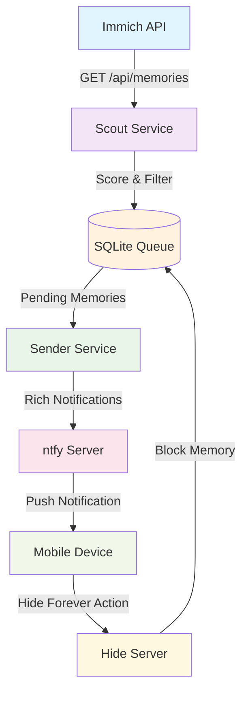

# Immich Memories

[](https://python.org)
[](https://docker.com)
[](LICENSE)

A self-hosted memory notification system that delivers meaningful "on this day" photo memories from your Immich instance via ntfy notifications.

## 🎯 Philosophy

Send fewer notifications, but make each one meaningful. Immich Memories uses intelligent scoring to surface your most valuable photo memories while respecting your preferences.

## ✨ Features

- **Smart Memory Scoring**: Advanced heuristics prioritize starred photos, named albums, faces, and significant locations
- **Album Integration**: Boosts scores for photos in curated albums while filtering out dumps like "Screenshots"
- **Beautiful Notifications**: Rich ntfy notifications with thumbnails, deep links, and contextual captions
- **Hide Forever**: One-tap action to permanently block unwanted memories
- **Scheduled Delivery**: Configurable cron schedules for discovery and delivery
- **Local-First**: No cloud dependencies - runs entirely on your infrastructure
- **Docker Ready**: Complete containerized deployment with health checks

## 🏗️ Architecture



## 🚀 Quick Start

### Prerequisites

- Docker and Docker Compose
- Immich instance with API access
- ntfy server (or use ntfy.sh)
- Python 3.9+ (for local development)

### Installation

1. **Clone the repository**
   ```bash
   git clone https://github.com/yourusername/immich-memories.git
   cd immich-memories
   ```

2. **Configure environment**
   ```bash
   # Copy and edit configuration
   cp config.yaml.example config.yaml
   
   # Set required environment variables
   export IMMICH_API_KEY="your-immich-api-key"
   export ENRICHER_SECRET="your-secret-key"
   ```

3. **Start services**
   ```bash
   docker compose up --build -d
   ```

4. **Verify setup**
   ```bash
   # Run a dry run to test configuration
   docker compose --profile manual run --rm scout --config /app/config.yaml --dry-run
   ```

## ⚙️ Configuration

The system is configured via `config.yaml`:

```yaml
immich:
  base_url: "http://immich-server:2283"
  api_key: "${IMMICH_API_KEY}"

ntfy:
  base_url: "http://ntfy"
  topic: "memories"

scout:
  threshold: 5                    # Minimum score to send
  home_gps: [45.8150, 15.9819]    # Home coordinates for distance scoring
  hide_action_url: "http://hide-server:8080/hide"

filters:
  album_blacklist:                 # Albums to exclude
    - "Screenshots"
    - "Documents"
    - "Work"
  album_dump_asset_threshold: 500  # Max assets before treating as dump

scheduler:
  scout_cron: "0 20 * * *"         # 8 PM daily
  sender_cron: "*/10 * * * *"      # Every 10 minutes
```

## 📖 Usage

### Manual Operations

```bash
# Discover and score memories
docker compose --profile manual run --rm scout

# Send queued notifications
docker compose --profile manual run --rm sender

# View queue status
docker compose exec scheduler sqlite3 data/queue.sqlite "SELECT * FROM queue;"
```

### Scoring System

Memories are scored based on:
- **+99**: Anniversary milestones (1 year, 5 years, etc.)
- **+2**: Saved photos
- **+1**: Photos in named albums
- **+1**: Photos with detected faces
- **Distance**: Proximity to home coordinates
- **Volume**: Number of photos in the memory

## 🔧 Development

### Local Development Setup

1. **Install dependencies**
   ```bash
   pip install -r requirements.txt
   ```

2. **Run components locally**
   ```bash
   # Test scout with dry run
   python scout.py --config config.yaml --dry-run
   
   # Start hide server
   python hide_server.py
   
   # Run scheduler
   python run_scheduler.py
   ```

3. **Linting**
   ```bash
   pnpm lint:fix
   ```

### Project Structure

```
immich-memories/
├── scout.py           # Memory discovery and scoring
├── sender.py          # Notification delivery
├── hide_server.py     # Hide action API
├── run_scheduler.py   # Cron job manager
├── enricher.py        # AI-powered enrichment
├── config.yaml        # Main configuration
├── docker-compose.yml # Container orchestration
├── requirements.txt   # Python dependencies
└── docs/wiki/         # Detailed documentation
```

## 📚 Documentation

- [Architecture](docs/wiki/Architecture.md) - System design and data flow
- [Installation](docs/wiki/Installation.md) - Detailed setup guide
- [Configuration](docs/wiki/Configuration.md) - All configuration options
- [Operations](docs/wiki/Operations.md) - Running and maintenance
- [Roadmap](docs/wiki/Roadmap.md) - Future development plans

## 🤝 Contributing

1. Fork the repository
2. Create a feature branch (`git checkout -b feature/amazing-feature`)
3. Commit your changes (`git commit -m 'Add amazing feature'`)
4. Push to the branch (`git push origin feature/amazing-feature`)
5. Open a Pull Request

### Development Guidelines

- Follow existing code style and patterns
- Run linting before committing (`pnpm lint:fix`)
- Add tests for new features
- Update documentation as needed

## 📄 License

This project is licensed under the MIT License - see the [LICENSE](LICENSE) file for details.

## 🙏 Acknowledgments

- [Immich](https://immich.app/) - Self-hosted photo management
- [ntfy](https://ntfy.sh/) - Simple notification service
- [supercronic](https://github.com/aptible/supercronic) - Cron job runner for containers

## 🐛 Support

- Create an [issue](https://github.com/yourusername/immich-memories/issues) for bugs or feature requests
- Check the [wiki](docs/wiki/) for detailed documentation
- Join our discussions for community support
