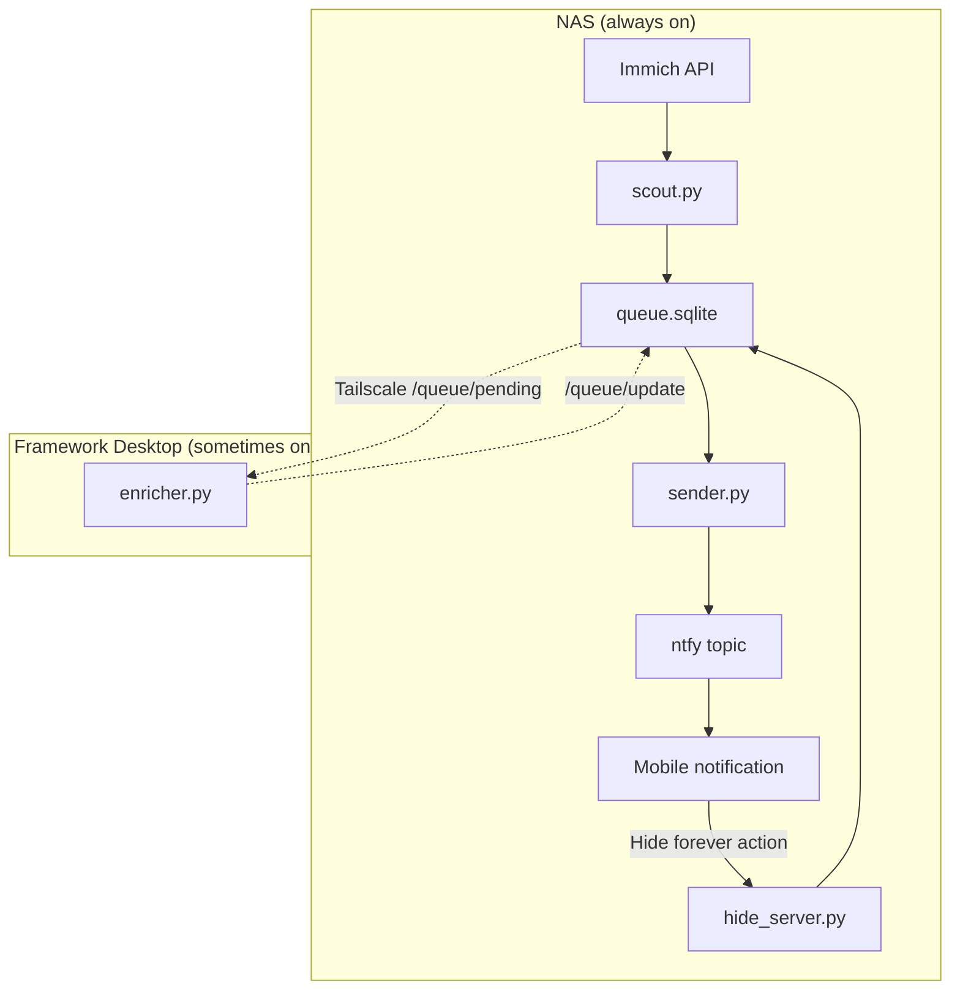

# Architecture

`immich-memories` runs as three independent jobs with a shared SQLite queue.

## Topology

## Components

- `enricher.py` (Phase 2 — runs on Framework Desktop)
  - Polls `GET /queue/pending` on the NAS hide-server every `enricher.poll_interval_minutes`
  - Fetches preview thumbnails for up to 5 candidate assets per memory from Immich
  - Calls local Ollama (`qwen2.5vl:7b`, fallback `moondream2`) with images + context
  - Receives structured JSON `{score, best_index, caption}` — parses with pydantic
  - POSTs result to `/queue/update`: status becomes `enriched` (score ≥ 5) or `skipped`
  - Falls back silently to heuristic caption if both models fail
  - Logs per-cycle metrics: success rate and avg latency
  - Auth: bearer token from `ENRICHER_SECRET` env var
- `scout.py`
  - Calls `GET /api/memories` with `type=on_this_day`
  - Optionally calls `GET /api/albums?assetId=` (sampled assets per memory) for album names — boosts score when a non-blacklisted, non-dump album matches
  - Scores each memory using heuristics aligned with `plan.md` (volume, starred, **named album**, saved +2, faces, distance, span, anniversary +99)
  - Picks a representative asset: favorite → most faces → closest GPS to the memory’s centroid → fallback
  - Builds captions from the template matrix (city, day-span, album, volume, anniversary prefix)
  - Upserts into `queue` as `pending`
- `sender.py`
  - Pulls pending/enriched rows from `queue`
  - Sends notifications to ntfy with thumbnail, deep link, and hide action
  - Marks rows as `sent` or `failed`
- `hide_server.py`
  - Exposes `POST /hide?memory_id=...`
  - Adds memory to the `hidden` table
  - Marks unsent queue rows as `skipped`
- `run_scheduler.py` + supercronic (Docker `scheduler` service)
  - Reads `scheduler.scout_cron` and `scheduler.sender_cron` from `config.yaml`
  - Writes a temporary crontab and runs [supercronic](https://github.com/aptible/supercronic) so job logs stay on stdout (Portainer-friendly)

## Data model

Two tables are shared across Phase 1 and Phase 2:

- `queue`
  - Holds queued notifications and delivery state
  - Includes `memory_id`, chosen `asset_id`, `score`, `caption`, and status timestamps
- `hidden`
  - Permanent memory-level blocklist keyed by `memory_id`
  - Used to prevent resurfacing unwanted memories

## Design choices

- Local-first and deterministic baseline: no cloud dependencies required
- Independent jobs: one failure does not break the whole pipeline
- Idempotency: `UNIQUE(memory_id)` prevents duplicate queue entries for the same memory
